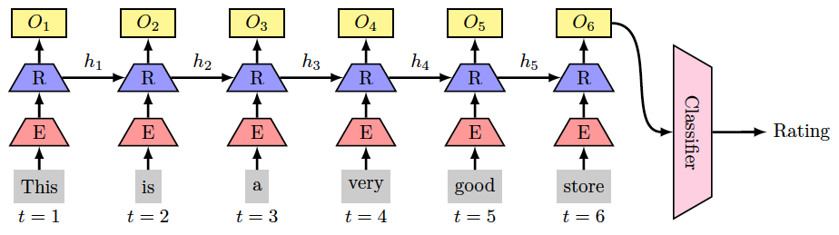
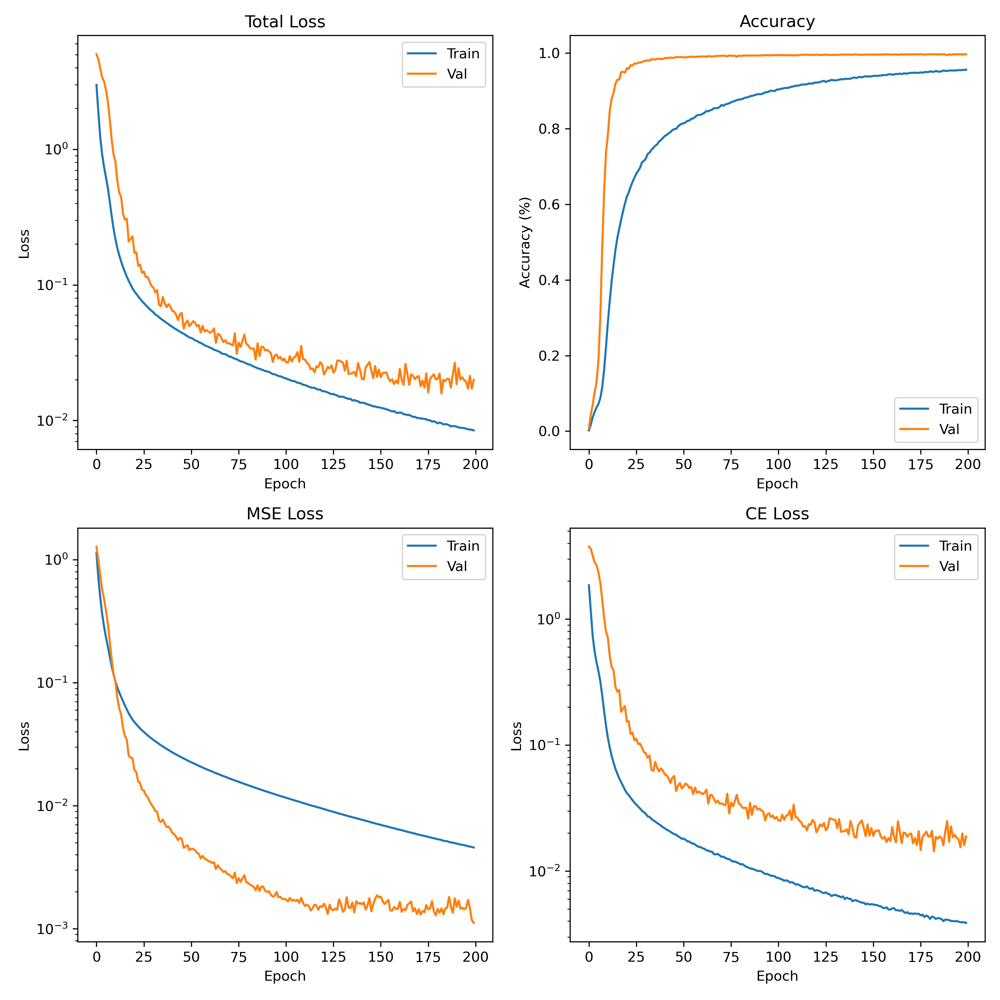

# DeepLearning-Project-3-Sequence-Modeling
In the first part of this project, we aim for developing an RNN model to perform rating prediction of yelp dataset. Then, in the second part of the project, we aim for developing a transformer model to perform translation task from English to Pig Latin.

This project was developed as part of CSE 849 (Deep Learning - Spring 25 Semester) at the Computer Science Department of Michigan State University, taught by Dr. Zijun Cui (@zijunjkl), with TA support from Gautam Sreekumar (@gautamsreekumar). Special thanks to them for their guidance and materials.
